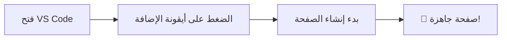

<div align="center">

# 🌐 Web Page Builder


### إضافة قوية لـ Visual Studio Code لإنشاء وتحرير صفحات HTML باللغة العربية


---

</div>

## 📋 جدول المحتويات

| القسم | الوصف |
|:-----:|:------|
| [🌟 نظرة عامة](#-نظرة-عامة) | تعرف على الإضافة ومميزاتها |
| [✨ المميزات](#-المميزات) | اكتشف كل ما تقدمه الإضافة |
| [📥 التثبيت](#-التثبيت) | كيفية تثبيت الإضافة |
| [🚀 الاستخدام](#-الاستخدام) | دليل الاستخدام الشامل |
| [📜 الأوامر](#-الأوامر) | قائمة الأوامر المتاحة |
| [📁 هيكل المشروع](#-هيكل-المشروع) | بنية المشروع البرمجية |
| [🤝 المساهمة](#-المساهمة) | كيف تساهم في التطوير |
| [📞 الدعم](#-الدعم) | روابط الدعم والمساعدة |

---

## 🌟 نظرة عامة

> **Web Page Builder** هي إضافة متكاملة لـ Visual Studio Code تتيح لك إنشاء صفحات ويب احترافية بسهولة ويسر.

### 🎯 لماذا Web Page Builder؟

| الميزة | الوصف |
|:------:|:------|
| 🚀 | **سهولة الاستخدام** - واجهة بسيطة باللغة العربية |
| ⚡ | **سرعة الإنتاج** - إنشاء صفحات في دقائق |
| 🎨 | **معاينة فورية** - شاهد التغييرات مباشرة |
| 💡 | **وسوم جاهزة** - مكتبة شاملة من عناصر HTML |
| 🔧 | **تخصيص كامل** - تحكم كامل في الكود |

---

## ✨ المميزات

### 1️⃣ محرر HTML متقدم

```
┌─────────────────────────────────────┐
│  🔤 محرر أكواد متقدم                │
│  🎨 تلوين الكود التلقائي            │
│  ↩️ دعم التراجع والإعادة            │
│  💾 حفظ سريع وفعال                  │
└─────────────────────────────────────┘
```

### 2️⃣ معاينة فورية

```
┌─────────────────────────────────────┐
│  👁️ معاينة حية أثناء التحرير        │
│  🔄 تحديث تلقائي فوري               │
│  🖱️ سحب وإفلات العناصر              │
│  📱 معاينة متجاوبة                  │
└─────────────────────────────────────┘
```

### 3️⃣ شريط جانبي للوسوم

<details>
<summary>📁 تصنيفات الوسوم المتاحة</summary>

| التصنيف | العناصر |
|:-------:|:--------|
| 🏠 العناصر الجذرية | `html`, `head`, `body` |
| 📋 بيانات الميتا | `meta`, `title`, `link` |
| ✏️ المحتوى النصي | `p`, `h1-h6`, `span` |
| 🎬 الوسائط | `img`, `video`, `audio` |
| 📝 النماذج | `form`, `input`, `button` |
| 🎮 التفاعلية | `details`, `dialog` |
| ⚡ السكربت | `script`, `noscript` |

</details>

### 4️⃣ إدارة الملفات

```
┌─────────────────────────────────────┐
│  📂 فتح ملفات HTML و XHTML          │
│  💾 حفظ باسم مع اختيار الموقع       │
│  ⚠️ تأكيد قبل استبدال الكود         │
└─────────────────────────────────────┘
```

---

## 📥 التثبيت

### 🛒 من VS Code Marketplace

```
1️⃣ افتح VS Code
2️⃣ اضغط Ctrl+Shift+X (أو Cmd+Shift+X على Mac)
3️⃣ ابحث عن "Web Page Builder"
4️⃣ اضغط "Install" ✅
```

### 📦 من ملف VSIX

```
1️⃣ حمّل ملف .vsix
2️⃣ افتح VS Code
3️⃣ اضغط Ctrl+Shift+P (أو Cmd+Shift+P على Mac)
4️⃣ اكتب "Extensions: Install from VSIX"
5️⃣ اختر الملف المحمّل ✅
```

---

## 🚀 الاستخدام

### 🎬 بدء الاستخدام



### ⌨️ اختصارات سريعة

| الإجراء | الاختصار |
|:-------:|:--------:|
| فتح لوحة الأوامر | `Ctrl+Shift+P` |
| فتح الإضافة | `Ctrl+Shift+P` → "Web Page Builder" |
| حفظ الملف | `Ctrl+S` |
| تراجع | `Ctrl+Z` |
| إعادة | `Ctrl+Y` |

---

## 📜 الأوامر

| الأمر | الوصف | الاختصار |
|:------|:------|:--------:|
| `webPageBuilder.openBuilder` | 🔓 فتح Web Page Builder | - |
| `webPageBuilder.viewSource` | 👁️ عرض المصدر | - |
| `webPageBuilder.openFile` | 📂 فتح ملف HTML | - |
| `webPageBuilder.saveAs` | 💾 حفظ باسم | - |
| `webPageBuilder.undo` | ↩️ تراجع | - |
| `webPageBuilder.redo` | ↪️ إعادة | - |
| `webPageBuilder.openWebviews` | 🖼️ فتح المعاينة | - |
| `webPageBuilder.tags` | 🏷️ قائمة الوسوم | - |
| `webPageBuilder.metadata` | 📋 البيانات الوصفية | - |
| `webPageBuilder.content` | ✏️ المحتوى | - |
| `webPageBuilder.media` | 🎬 الوسائط | - |
| `webPageBuilder.forms` | 📝 النماذج | - |

---

## 📁 هيكل المشروع

```
📦 web-page-builder/
├── 📂 src/
│   ├── 📂 commands/
│   │   └── 📄 index.ts              # أوامر الإضافة
│   ├── 📂 events/
│   │   └── 📄 codeEventEmitter.ts   # نظام الأحداث
│   ├── 📂 panels/
│   │   ├── 📄 editorPanel.ts        # لوحة المحرر
│   │   └── 📄 webPageBuilderPanel.ts # لوحة المعاينة
│   ├── 📂 providers/
│   │   └── 📄 sidebarProvider.ts    # موفر الشريط الجانبي
│   └── 📂 webviews/
│       ├── 📄 sidebarWebview.html   # HTML الشريط الجانبي
│       ├── 📄 sidebar.css           # تنسيق الشريط الجانبي
│       ├── 📄 sidebar.js            # سكربت الشريط الجانبي
│       ├── 📄 webPageBuilderPanel.html # HTML المعاينة
│       ├── 📄 webPageBuilderPanel.css  # تنسيق المعاينة
│       └── 📄 webPageBuilderPanel.js   # سكربت المعاينة
├── 📄 package.json                  # إعدادات الإضافة
├── 📄 tsconfig.json                 # إعدادات TypeScript
└── 📄 README.md                     # هذا الملف
```

---

## 🤝 المساهمة

<div align="center">

### نرحب بمساهماتكم! 🙌

</div>

| نوع المساهمة | الرابط |
|:------------:|:------:|
| 🐛 الإبلاغ عن مشكلة | [فتح Issue](https://github.com/almhajer/web-page-builder/issues/new) |
| 💡 طلب ميزة جديدة | [طلب Feature](https://github.com/almhajer/web-page-builder/compare) |
| 🔧 المساهمة في الكود | [فتح Pull Request](https://github.com/almhajer/web-page-builder/pulls) |

### 📝 خطوات المساهمة

```
1️⃣ Fork المشروع
2️⃣ إنشاء فرع جديد
   git checkout -b feature/amazing-feature
3️⃣ Commit التغييرات
   git commit -m '✨ إضافة ميزة رائعة'
4️⃣ Push إلى الفرع
   git push origin feature/amazing-feature
5️⃣ فتح Pull Request 🎉
```

---

## 🛠️ التطوير

### 📋 المتطلبات

| المتطلب | الإصدار |
|:-------:|:-------:|
| Node.js | 16+ |
| VS Code | 1.74+ |
| TypeScript | 4.9+ |

### 🔨 البناء والتشغيل

```bash
# تثبيت التبعيات
npm install

# بناء المشروع
npm run compile

# مراقبة التغييرات
npm run watch

# تشغيل الاختبارات
npm run test
```

### 🧪 التشغيل في وضع التطوير

```
1️⃣ افتح المشروع في VS Code
2️⃣ اضغط F5 لتشغيل الإضافة في نافذة جديدة
3️⃣ اختبر التغييرات مباشرة! 🚀
```

---

## 📞 الدعم

### 👥 المساهمون الرئيسيون

<div align="center">

| المساهم | الدور |
|:-------:|:-----:|
| **بشير الحسن** | 👨‍💻 مطور رئيسي |
| **عبدالكافي الحسن** | 👨‍💻 مطور رئيسي |
| **شكري الحسن** | 👨‍💻 مطور رئيسي |
| **عبدالقادر الحسن** | 👨‍💻 مطور رئيسي |

</div>

> 💚 **توكل على الله وابدأ على بركته!** 
> 
> الدعاء لوالدي ولجميع المسلمين.

### 🌐 روابط مفيدة

| الرابط | الوصف |
|:------:|:------|
| [🌐 4Techs.net](https://www.4Techs.net) | الموقع الرسمي |
| [📦 VS Marketplace](https://marketplace.visualstudio.com/publisher/Arabic-language) | صفحة الناشر |

### 📦 إضافات أخرى من فريق 4Techs

| الإضافة | الوصف | الرابط |
|:-------:|:------|:------:|
| 🌐 Arabic To HTML | برمجة صفحات HTML بالعربي | [VS Marketplace](https://marketplace.visualstudio.com/items?itemName=Arabic-language.arabictohtml) |
| 🌍 VS Code AR | إضافة اللغة العربية | [VS Marketplace](https://marketplace.visualstudio.com/items?itemName=Arabic-language.vscode-ar) |
| 🔄 Auto Language | مبدل اللغة التلقائي | [VS Marketplace](https://marketplace.visualstudio.com/items?itemName=Arabic-language.autolanguage) |

---

## 📄 الترخيص

```
MIT License

هذا المشروع مرخص تحت رخصة MIT
راجع ملف LICENSE للتفاصيل
```

---

<div align="center">

### 🌟 إذا أعجبك المشروع، لا تنسَ إضافة ⭐!

---

**صنع بـ ❤️ للمجتمع العربي**

[](https://www.4Techs.net)
[](https://marketplace.visualstudio.com/publisher/Arabic-language)

---

</div>
