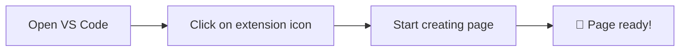

<div align="center">

# 🌐 Web Page Builder


### A powerful Visual Studio Code extension for creating and editing HTML pages in Arabic


---

</div>

## 📋 Table of Contents

| Section | Description |
|:-------:|:-----------|
| [🌟 Overview](#-overview) | Learn about the extension and its features |
| [✨ Features](#-features) | Discover everything the extension offers |
| [📥 Installation](#-installation) | How to install the extension |
| [🚀 Usage](#-usage) | Comprehensive usage guide |
| [📜 Commands](#-commands) | List of available commands |
| [📁 Project Structure](#-project-structure) | Software project architecture |
| [🤝 Contributing](#-contributing) | How to contribute to development |
| [📞 Support](#-support) | Support and help links |

---

## 🌟 Overview

> **Web Page Builder** is a comprehensive extension for Visual Studio Code that allows you to create professional web pages easily and quickly.

### 🎯 Why Web Page Builder?

| Feature | Description |
|:-------:|:-----------|
| 🚀 | **Ease of Use** - Simple interface in Arabic |
| ⚡ | **Fast Production** - Create pages in minutes |
| 🎨 | **Live Preview** - See changes instantly |
| 💡 | **Ready-made Tags** - Comprehensive library of HTML elements |
| 🔧 | **Full Customization** - Complete control over the code |

---

## ✨ Features

### 1️⃣ Advanced HTML Editor

```
┌─────────────────────────────────────┐
│  🔤 Advanced code editor           │
│  🎨 Automatic code highlighting    │
│  ↩️ Undo and redo support          │
│  💾 Fast and efficient saving      │
└─────────────────────────────────────┘
```

### 2️⃣ Live Preview

```
┌─────────────────────────────────────┐
│  👁️ Live preview while editing     │
│  🔄 Instant automatic update       │
│  🖱️ Drag and drop elements        │
│  📱 Responsive preview            │
└─────────────────────────────────────┘
```

### 3️⃣ Sidebar for Tags

<details>
<summary>📁 Available Tag Categories</summary>

| Category | Elements |
|:-------:|:---------|
| 🏠 Root Elements | `html`, `head`, `body` |
| 📋 Metadata | `meta`, `title`, `link` |
| ✏️ Text Content | `p`, `h1-h6`, `span` |
| 🎬 Media | `img`, `video`, `audio` |
| 📝 Forms | `form`, `input`, `button` |
| 🎮 Interactive | `details`, `dialog` |
| ⚡ Scripts | `script`, `noscript` |

</details>

### 4️⃣ File Management

```
┌─────────────────────────────────────┐
│  📂 Open HTML and XHTML files     │
│  💾 Save As with location choice  │
│  ⚠️ Confirmation before overwriting │
└─────────────────────────────────────┘
```

---

## 📥 Installation

### 🛒 From VS Code Marketplace

```
1️⃣ Open VS Code
2️⃣ Press Ctrl+Shift+X (or Cmd+Shift+X on Mac)
3️⃣ Search for "Web Page Builder"
4️⃣ Click "Install" ✅
```

### 📦 From VSIX File

```
1️⃣ Download the .vsix file
2️⃣ Open VS Code
3️⃣ Press Ctrl+Shift+P (or Cmd+Shift+P on Mac)
4️⃣ Type "Extensions: Install from VSIX"
5️⃣ Select the downloaded file ✅
```

---

## 🚀 Usage

### 🎬 Getting Started



### ⌨️ Quick Shortcuts

| Action | Shortcut |
|:-------:|:--------:|
| Open Command Palette | `Ctrl+Shift+P` |
| Open Extension | `Ctrl+Shift+P` → "Web Page Builder" |
| Save File | `Ctrl+S` |
| Undo | `Ctrl+Z` |
| Redo | `Ctrl+Y` |

---

## 📜 Commands

| Command | Description | Shortcut |
|:--------|:-----------|:--------:|
| `webPageBuilder.openBuilder` | 🔓 Open Web Page Builder | - |
| `webPageBuilder.viewSource` | 👁️ View Source | - |
| `webPageBuilder.openFile` | 📂 Open HTML File | - |
| `webPageBuilder.saveAs` | 💾 Save As | - |
| `webPageBuilder.undo` | ↩️ Undo | - |
| `webPageBuilder.redo` | ↪️ Redo | - |
| `webPageBuilder.openWebviews` | 🖼️ Open Preview | - |
| `webPageBuilder.tags` | 🏷️ Tags List | - |
| `webPageBuilder.metadata` | 📋 Metadata | - |
| `webPageBuilder.content` | ✏️ Content | - |
| `webPageBuilder.media` | 🎬 Media | - |
| `webPageBuilder.forms` | 📝 Forms | - |

---

## 📁 Project Structure

```
📦 web-page-builder/
├── 📂 src/
│   ├── 📂 commands/
│   │   └── 📄 index.ts              # Extension commands
│   ├── 📂 events/
│   │   └── 📄 codeEventEmitter.ts   # Event system
│   ├── 📂 panels/
│   │   ├── 📄 editorPanel.ts        # Editor panel
│   │   └── 📄 webPageBuilderPanel.ts # Preview panel
│   ├── 📂 providers/
│   │   └── 📄 sidebarProvider.ts    # Sidebar provider
│   └── 📂 webviews/
│       ├── 📄 sidebarWebview.html   # Sidebar HTML
│       ├── 📄 sidebar.css           # Sidebar styling
│       ├── 📄 sidebar.js            # Sidebar script
│       ├── 📄 webPageBuilderPanel.html # Preview HTML
│       ├── 📄 webPageBuilderPanel.css  # Preview styling
│       └── 📄 webPageBuilderPanel.js   # Preview script
├── 📄 package.json                  # Extension configuration
├── 📄 tsconfig.json                 # TypeScript configuration
└── 📄 README.md                     # This file
```

---

## 🤝 Contributing

<div align="center">

### We welcome your contributions! 🙌

</div>

| Contribution Type | Link |
|:---------------:|:-----:|
| 🐛 Report a bug | [Open Issue](https://github.com/almhajer/web-page-builder/issues/new) |
| 💡 Request a feature | [Request Feature](https://github.com/almhajer/web-page-builder/compare) |
| 🔧 Contribute code | [Open Pull Request](https://github.com/almhajer/web-page-builder/pulls) |

### 📝 Contribution Steps

```
1️⃣ Fork the project
2️⃣ Create a new branch
   git checkout -b feature/amazing-feature
3️⃣ Commit changes
   git commit -m '✨ Add amazing feature'
4️⃣ Push to branch
   git push origin feature/amazing-feature
5️⃣ Open Pull Request 🎉
```

---

## 🛠️ Development

### 📋 Requirements

| Requirement | Version |
|:-----------:|:-------:|
| Node.js | 16+ |
| VS Code | 1.74+ |
| TypeScript | 4.9+ |

### 🔨 Building and Running

```bash
# Install dependencies
npm install

# Build the project
npm run compile

# Watch for changes
npm run watch

# Run tests
npm run test
```

### 🧪 Running in Development Mode

```
1️⃣ Open the project in VS Code
2️⃣ Press F5 to run the extension in a new window
3️⃣ Test changes directly! 🚀
```

---

## 📞 Support

### 👥 Main Contributors

<div align="center">

| Contributor | Role |
|:----------:|:----:|
| **Bashir Al-Hassan** | 👨‍💻 Lead Developer |
| **Abdulkafi Al-Hassan** | 👨‍💻 Lead Developer |
| **Shukri Al-Hassan** | 👨‍💻 Lead Developer |
| **Abdulqader Al-Hassan** | 👨‍💻 Lead Developer |

</div>

> 💚 **Trust in Allah and start with His blessings!** 
> 
> Prayers for my parents and all Muslims.

### 🌐 Useful Links

| Link | Description |
|:----:|:-----------|
| [🌐 4Techs.net](https://www.4Techs.net) | Official Website |
| [📦 VS Marketplace](https://marketplace.visualstudio.com/publishers/Arabic-language) | Publisher Page |

### 📦 Other Extensions from 4Techs Team

| Extension | Description | Link |
|:---------:|:-----------|:-----:|
| 🌐 Arabic To HTML | HTML programming in Arabic | [VS Marketplace](https://marketplace.visualstudio.com/items?itemName=Arabic-language.arabictohtml) |
| 🌍 VS Code AR | Add Arabic language | [VS Marketplace](https://marketplace.visualstudio.com/items?itemName=Arabic-language.vscode-ar) |
| 🔄 Auto Language | Automatic language switcher | [VS Marketplace](https://marketplace.visualstudio.com/items?itemName=Arabic-language.autolanguage) |

---

## 📄 License

```
MIT License

This project is licensed under the MIT License
See LICENSE file for details
```

---

<div align="center">

### 🌟 If you liked the project, don't forget to add a ⭐!

---

**Made with ❤️ for the Arabic community**

[](https://www.4Techs.net)
[](https://marketplace.visualstudio.com/publisher/Arabic-language)

---

</div>
